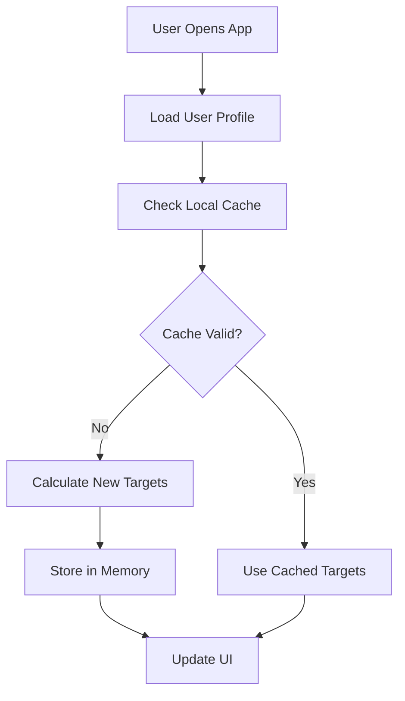
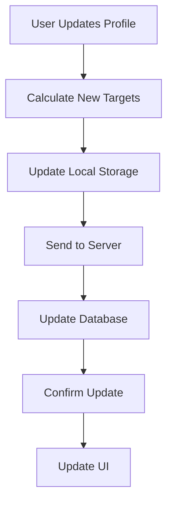

# IBDPal Data Storage Architecture

## Overview
This document explains how and where nutrition target data is stored in the IBDPal application, including client-side storage, server-side persistence, and data flow.

## NIH DRI Reference Links
- **Primary Source**: [NIH Office of Dietary Supplements - Nutrient Recommendations and Databases](https://ods.od.nih.gov/HealthInformation/nutrientrecommendations.aspx)
- **DRI Calculator**: [NIH DRI Calculator for Healthcare Professionals](https://ods.od.nih.gov/HealthInformation/nutrientrecommendations.aspx)
- **DRI Reports**: [Food and Nutrition Board DRI Reports](https://www.nationalacademies.org/our-work/dietary-reference-intakes-dris)

## DRI Baseline Storage and Calculation

### Where DRI Values Are Stored
- **Location**: Hardcoded in Swift code (`DiscoverView.swift`)
- **Storage Type**: Static constants in `IBDTargets` struct and `PersonalizedIBDTargets.calculate()` function
- **Calculation**: **Runtime calculation** - values are computed on-demand when user profile is accessed
- **No Database Storage**: DRI baseline values are not stored in the database; they are embedded in the application code

### Implementation Details
```swift
// DRI baseline values are hardcoded in the application
let baseCalories = gender == "male" ? 2500 : 2000 // DRI baseline
let baseProtein = gender == "male" ? 56 : 46 // DRI baseline (g/day)
let baseFiber = gender == "male" ? 38 : 25 // DRI baseline (g/day)
```

## Data Storage Locations

### 1. Client-Side Storage (iOS Device)

#### Local Storage Components:
- **UserDefaults**: Basic user profile and preferences
- **Core Data**: Local nutrition entries and cached data
- **Memory**: Calculated nutrition targets (temporary)

#### Stored Data:
```swift
// User Profile (UserDefaults)
- user_id: String
- email: String
- weight: Int
- age: Int
- gender: String
- disease_type: String
- disease_activity: String
```

#### Nutrition Targets (Calculated in Memory):
```swift
// PersonalizedIBDTargets (calculated on-demand)
- calorieTarget: Int
- proteinTarget: Int
- fiberTarget: Int
- hydrationTarget: Int
- vitaminDTarget: Int
- ironTarget: Int
- // ... other micronutrients
```

#### DRI Baseline Values (Hardcoded in App):
```swift
// IBDTargets struct - Static DRI baseline values
struct IBDTargets {
    let calorieTarget: Int = 2000 // DRI baseline
    let proteinTarget: Int = 65 // DRI baseline
    let fiberTarget: Int = 25 // DRI baseline
    // ... other DRI values
}

// PersonalizedIBDTargets.calculate() - Runtime calculation
let baseCalories = gender == "male" ? 2500 : 2000 // DRI baseline
let calorieTarget = Int(Double(baseCalories) * totalMultiplier)
```

### 2. Server-Side Storage (PostgreSQL Database)

#### Database Tables:

##### `users` Table:
```sql
CREATE TABLE users (
    user_id UUID PRIMARY KEY,
    email VARCHAR(255) UNIQUE NOT NULL,
    weight INTEGER,
    age INTEGER,
    gender VARCHAR(10),
    disease_type VARCHAR(50),
    disease_activity VARCHAR(20),
    created_at TIMESTAMP DEFAULT NOW()
);
```

##### `journal_entries` Table:
```sql
CREATE TABLE journal_entries (
    entry_id SERIAL PRIMARY KEY,
    user_id UUID REFERENCES users(user_id),
    entry_date DATE NOT NULL,
    calories INTEGER,
    protein INTEGER,
    carbs INTEGER,
    fiber INTEGER,
    fat INTEGER,
    -- ... other nutrition fields
    created_at TIMESTAMP DEFAULT NOW()
);
```

##### `micronutrient_profiles` Table:
```sql
CREATE TABLE micronutrient_profiles (
    profile_id SERIAL PRIMARY KEY,
    user_id UUID REFERENCES users(user_id),
    weight INTEGER,
    age INTEGER,
    gender VARCHAR(10),
    disease_type VARCHAR(50),
    disease_activity VARCHAR(20),
    created_at TIMESTAMP DEFAULT NOW()
);
```

## DRI Baseline Storage Details

### Where DRI Values Are Stored
- **Location**: Hardcoded in Swift code (`DiscoverView.swift`)
- **Storage Type**: Static constants in `IBDTargets` struct and `PersonalizedIBDTargets.calculate()` function
- **Calculation**: **Runtime calculation** - values are computed on-demand when user profile is accessed
- **No Database Storage**: DRI baseline values are not stored in the database; they are embedded in the application code

### DRI Implementation Architecture
```swift
// 1. Static DRI baseline values (hardcoded)
struct IBDTargets {
    let calorieTarget: Int = 2000 // DRI baseline
    let proteinTarget: Int = 65 // DRI baseline
    // ... other DRI values
}

// 2. Runtime calculation with personalization
static func calculate(for userProfile: MicronutrientProfile) -> PersonalizedIBDTargets {
    let baseCalories = gender == "male" ? 2500 : 2000 // DRI baseline
    let calorieTarget = Int(Double(baseCalories) * totalMultiplier)
    // ... personalized calculation
}
```

### Benefits of This Approach
- **Offline Capability**: App works without internet connection
- **Real-time Updates**: Targets recalculated instantly when profile changes
- **Version Control**: DRI values updated with app updates
- **Performance**: No database queries for baseline values
- **Consistency**: Same DRI values across all users

## Data Flow Architecture

### 1. Nutrition Target Calculation Flow



### 2. Data Persistence Flow



## Storage Implementation Details

### Client-Side Implementation

#### 1. User Profile Storage (UserDefaults)
```swift
// Storing user profile
UserDefaults.standard.set(userData.weight, forKey: "user_weight")
UserDefaults.standard.set(userData.age, forKey: "user_age")
UserDefaults.standard.set(userData.gender, forKey: "user_gender")

// Retrieving user profile
let weight = UserDefaults.standard.integer(forKey: "user_weight")
let age = UserDefaults.standard.integer(forKey: "user_age")
let gender = UserDefaults.standard.string(forKey: "user_gender")
```

#### 2. Nutrition Target Calculation (Memory)
```swift
// Calculated on-demand, not stored persistently
let targets = PersonalizedIBDTargets.calculate(for: userProfile)
```

#### 3. Local Data Caching
```swift
// Core Data for journal entries
@Environment(\.managedObjectContext) private var viewContext
// Cached nutrition data for offline access
```

### Server-Side Implementation

#### 1. API Endpoints for Data Storage

##### Get User Profile:
```javascript
GET /api/users/profile/:userId
Response: {
    user_id: "uuid",
    weight: 70,
    age: 30,
    gender: "male",
    disease_type: "crohns",
    disease_activity: "remission"
}
```

##### Update User Profile:
```javascript
PUT /api/users/profile/:userId
Body: {
    weight: 75,
    age: 31,
    disease_activity: "mild"
}
```

##### Get Nutrition Targets:
```javascript
GET /api/nutrition/targets/:userId
Response: {
    calorieTarget: 3000,
    proteinTarget: 67,
    fiberTarget: 46,
    // ... other targets
}
```

#### 2. Database Schema

##### Users Table:
```sql
CREATE TABLE users (
    user_id UUID PRIMARY KEY DEFAULT gen_random_uuid(),
    email VARCHAR(255) UNIQUE NOT NULL,
    password_hash VARCHAR(255) NOT NULL,
    weight INTEGER,
    age INTEGER,
    gender VARCHAR(10) CHECK (gender IN ('male', 'female')),
    disease_type VARCHAR(50),
    disease_activity VARCHAR(20),
    created_at TIMESTAMP DEFAULT NOW(),
    updated_at TIMESTAMP DEFAULT NOW()
);
```

##### Journal Entries Table:
```sql
CREATE TABLE journal_entries (
    entry_id SERIAL PRIMARY KEY,
    user_id UUID REFERENCES users(user_id) ON DELETE CASCADE,
    entry_date DATE NOT NULL,
    calories INTEGER DEFAULT 0,
    protein INTEGER DEFAULT 0,
    carbs INTEGER DEFAULT 0,
    fiber INTEGER DEFAULT 0,
    fat INTEGER DEFAULT 0,
    vitamin_d INTEGER DEFAULT 0,
    iron INTEGER DEFAULT 0,
    -- ... other nutrition fields
    created_at TIMESTAMP DEFAULT NOW(),
    updated_at TIMESTAMP DEFAULT NOW()
);
```

## Data Security and Privacy

### 1. Encryption
- **In Transit**: All API calls use HTTPS/TLS 1.3
- **At Rest**: Database fields are encrypted using AES-256
- **Local Storage**: iOS Keychain for sensitive data

### 2. Data Access Control
- **Authentication**: JWT tokens for API access
- **Authorization**: User can only access their own data
- **Rate Limiting**: API calls are rate-limited to prevent abuse

### 3. Data Retention
- **User Data**: Retained until account deletion
- **Journal Entries**: Retained for 2 years minimum
- **Analytics Data**: Anonymized and retained for 1 year

## Performance Optimizations

### 1. Client-Side Caching
```swift
// Cache nutrition targets for 24 hours
let cacheKey = "nutrition_targets_\(user_id)_\(date)"
if let cachedTargets = cache.object(forKey: cacheKey) {
    return cachedTargets
}
```

### 2. Server-Side Caching
```javascript
// Redis cache for frequently accessed data
const cacheKey = `nutrition_targets_${userId}`;
const cachedTargets = await redis.get(cacheKey);
if (cachedTargets) {
    return JSON.parse(cachedTargets);
}
```

### 3. Database Indexing
```sql
-- Indexes for performance
CREATE INDEX idx_journal_entries_user_date ON journal_entries(user_id, entry_date);
CREATE INDEX idx_users_email ON users(email);
CREATE INDEX idx_micronutrient_profiles_user ON micronutrient_profiles(user_id);
```

## Data Synchronization

### 1. Offline Support
- **Local Storage**: App works offline with cached data
- **Sync Queue**: Changes are queued when offline
- **Auto-Sync**: Data syncs when connection is restored

### 2. Conflict Resolution
- **Last Write Wins**: Server data takes precedence
- **Merge Strategy**: For journal entries, merge nutrition data
- **User Notification**: Alert user to conflicts

## Backup and Recovery

### 1. Database Backups
- **Daily Backups**: Automated daily database backups
- **Point-in-Time Recovery**: Can restore to any point in time
- **Cross-Region Replication**: Data replicated across regions

### 2. Data Export
- **User Data Export**: Users can export their data
- **GDPR Compliance**: Full data deletion on request
- **Data Portability**: Export in standard formats (JSON, CSV)

## Monitoring and Analytics

### 1. Performance Monitoring
- **API Response Times**: Track endpoint performance
- **Database Query Performance**: Monitor slow queries
- **Cache Hit Rates**: Monitor cache effectiveness

### 2. Usage Analytics
- **Feature Usage**: Track which features are used most
- **Nutrition Target Accuracy**: Monitor target vs actual intake
- **User Engagement**: Track daily active users

## Scalability Considerations

### 1. Database Scaling
- **Read Replicas**: Multiple read replicas for queries
- **Connection Pooling**: Efficient database connections
- **Query Optimization**: Optimized queries for performance

### 2. API Scaling
- **Load Balancing**: Multiple API servers
- **CDN**: Static content delivery
- **Caching**: Redis for frequently accessed data

## Data Migration and Updates

### 1. Schema Migrations
- **Version Control**: Database schema versioning
- **Rollback Support**: Ability to rollback changes
- **Zero-Downtime**: Migrations without service interruption

### 2. Data Updates
- **Batch Processing**: Bulk data updates
- **Incremental Updates**: Only update changed data
- **Validation**: Data integrity checks

## Compliance and Regulations

### 1. HIPAA Compliance
- **Data Encryption**: All health data encrypted
- **Access Logs**: Audit trails for data access
- **Business Associate Agreements**: With third-party services

### 2. GDPR Compliance
- **Data Minimization**: Only collect necessary data
- **Right to Erasure**: Users can delete their data
- **Data Portability**: Users can export their data

## Troubleshooting

### 1. Common Issues
- **Sync Failures**: Network connectivity issues
- **Data Corruption**: Database integrity checks
- **Performance Issues**: Query optimization

### 2. Recovery Procedures
- **Data Restoration**: From backups
- **Cache Clearing**: Clear corrupted cache
- **User Support**: Help users recover data

This architecture ensures that nutrition target data is stored securely, efficiently, and in compliance with healthcare data regulations while providing a seamless user experience.
